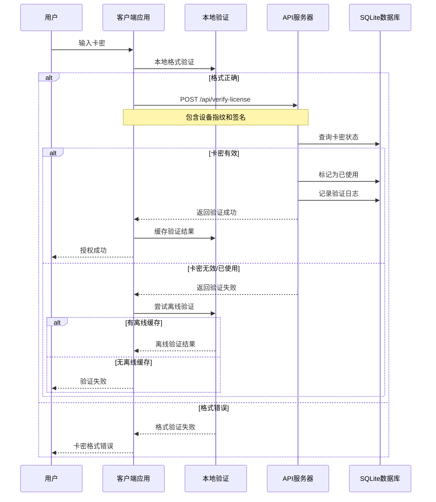

# 🎫 雷雨传媒卡密系统完整使用说明

## 📋 系统架构概览

您的卡密系统采用**双重架构设计**，包含两个独立但协同工作的组件：

### 🖥️ **桌面应用 (主目录)**
- **文件**: `main.js`, `license-manager.js`, `index.html`
- **功能**: 客户端验证、本地缓存、用户界面
- **用途**: 最终用户使用，验证卡密并获得授权

### 🌐 **API服务器 (server目录)**
- **文件**: `license-api-server-sqlite.js`, `license-api-server.js`
- **功能**: 在线验证、数据库管理、统计分析
- **用途**: 中央验证服务，管理所有卡密数据

### 🛠️ **卡密生成器**
- **文件**: `license-generator-main.js`, `license-generator.html`
- **功能**: 批量生成卡密、上传到服务器、管理界面
- **用途**: 管理员工具，生成和管理卡密

## 🔄 验证流程详解

### 1. **完整验证流程**



### 2. **双重验证机制**

#### 🔍 **在线验证** (主要方式)
- 连接到API服务器进行实时验证
- 检查卡密状态、有效期、使用情况
- 记录验证日志和设备信息
- 防止重复使用和盗用

#### 💾 **离线验证** (备用方式)
- 当网络不可用时启用
- 使用本地缓存的验证数据
- 验证设备指纹匹配
- 有限的离线使用期限

## 🚀 使用步骤

### **第一步：启动API服务器**

```bash
cd server
node license-api-server-sqlite.js
```

服务器启动后会显示：
```
🚀 雷雨传媒卡密验证服务器启动成功！
📡 服务器地址: http://localhost:3000
📊 数据库: SQLite
```

### **第二步：生成卡密**

1. 启动卡密生成器：
```bash
npm run generator
# 或者
node license-generator-main.js
```

2. 在生成器界面中：
   - 选择卡密级别（基础版/专业版/企业版）
   - 设置有效期（天数）
   - 输入生成数量
   - 点击"批量生成"

3. 生成后点击"📤 上传到服务器"将卡密同步到API服务器

### **第三步：分发和使用**

1. 将生成的卡密分发给用户
2. 用户在客户端应用中输入卡密
3. 系统自动进行在线验证
4. 验证成功后用户获得相应权限

## 🔧 新增功能说明

### 📤 **批量上传功能**
- 生成卡密后可一键上传到服务器
- 支持大批量数据分批上传
- 实时显示上传进度和结果

### 🌐 **服务器状态监控**
- 实时检查API服务器连接状态
- 显示服务器健康状态和响应时间
- 网络异常时自动提示

### 📊 **统计分析功能**
- 总卡密数量统计
- 已使用/未使用卡密分析
- 24小时验证次数统计
- 状态分布图表

### 🗂️ **服务器管理界面**
- 查看服务器中所有卡密
- 按状态、批次筛选
- 搜索特定卡密
- 查看使用时间和详情

## 🎯 解决的问题

### ✅ **之前缺失的功能现已完善：**

1. **卡密生成后无法上传** → 新增批量上传功能
2. **无法查看服务器状态** → 新增服务器监控
3. **缺少使用统计** → 新增详细统计分析
4. **无法管理已生成卡密** → 新增服务器管理界面
5. **验证流程不清晰** → 完善双重验证机制

### 🔄 **完整的卡密生命周期：**

```
生成 → 上传 → 分发 → 验证 → 使用 → 统计 → 管理
```

## 🛡️ 安全特性

- **设备指纹绑定**：防止卡密在多设备使用
- **请求签名验证**：防止API请求伪造
- **时间戳验证**：防止重放攻击
- **速率限制**：防止暴力破解
- **加密存储**：本地数据加密保存

## 📞 技术支持

如果在使用过程中遇到问题：

1. 检查API服务器是否正常运行
2. 确认网络连接状态
3. 查看控制台错误信息
4. 检查卡密格式是否正确

现在您的卡密系统已经是一个功能完整的企业级解决方案！🎉
